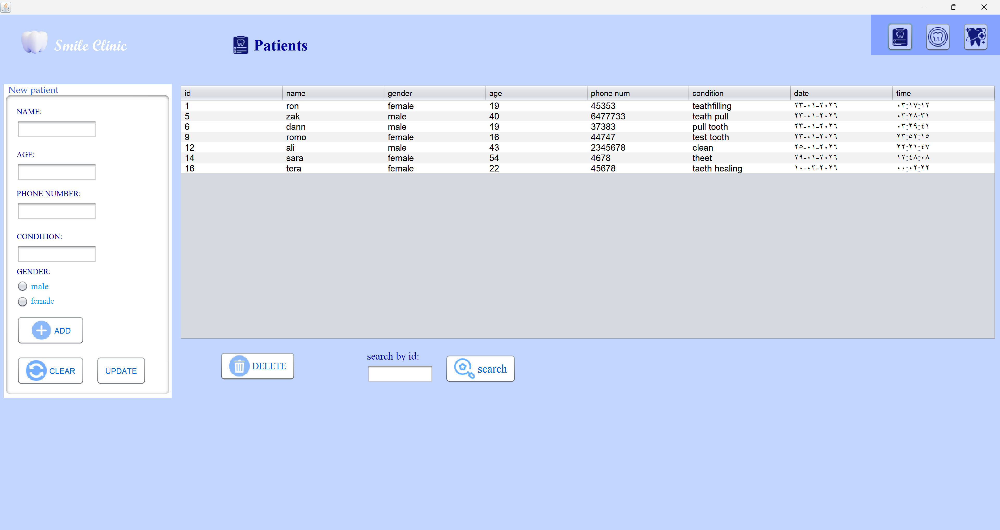
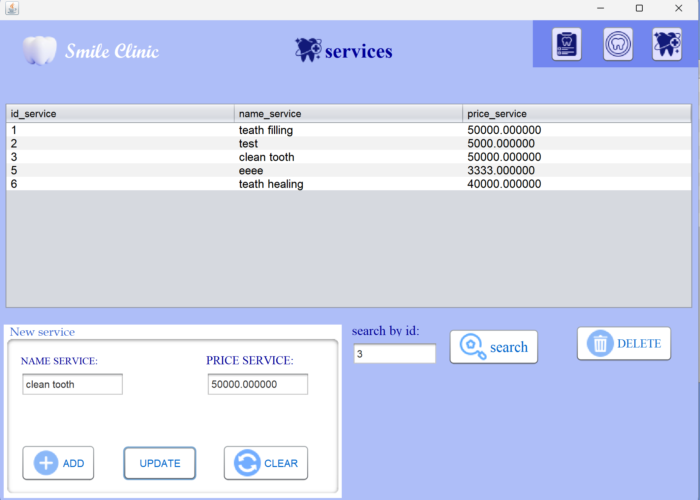
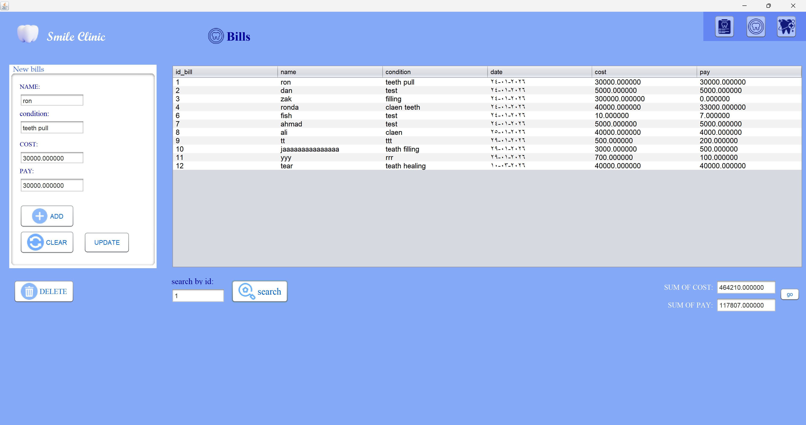

# 🦷 Smile Clinic Management System

A robust **Java-based desktop application** designed to streamline dental clinic operations. This project implements a full **CRUD** (Create, Read, Update, Delete) architecture to manage patient records, medical billing, and service pricing efficiently.

---

## Key Features

* **Patient Records Management:** Register new patients, update medical histories, and maintain organized contact data.
* **Automated Billing System:** Generate and manage invoices based on treatments and services provided.
* **Service & Pricing Dashboard:** A dedicated interface to manage the clinic's service catalog and dynamic pricing.
* **Secure Database Connectivity:** Stable integration with MySQL using **JDBC** (Java Database Connectivity).

##  Tech Stack

* **Language:** Java (JDK 8 or higher)
* **IDE:** NetBeans
* **Database:** MySQL (Managed via Laragon)
* **Driver:** MySQL Connector/J

---

## Project Walkthrough

Below are the core interfaces of the system:

### 1. Patient Management
*Efficiently track and manage patient data.*

### 2. Billing & Invoicing
*Financial tracking and invoice generation.*

### 3. Services & Pricing
*Control the clinic's treatment list and costs.*

---

## Installation & Setup

### Database Configuration (Laragon)
The project relies on a MySQL backend. To set it up:
1.  Start **Laragon** and ensure the **MySQL** service is running.
2.  Create a new database named `smile_clinic`.
3.  Import the provided `database.sql` file into your MySQL server.
4.  Update the database credentials (URL, User, Password) in the Java source code to match your local environment.

### Running the Application
1.  Clone this repository to your local machine.
2.  Open the project folder in **NetBeans IDE**.
3.  Add the `mysql-connector-java.jar` to the project's **Libraries**.
4.  Build and Run the project.

---

## 📄 License
This project was developed for educational purposes as part of my software development portfolio.
